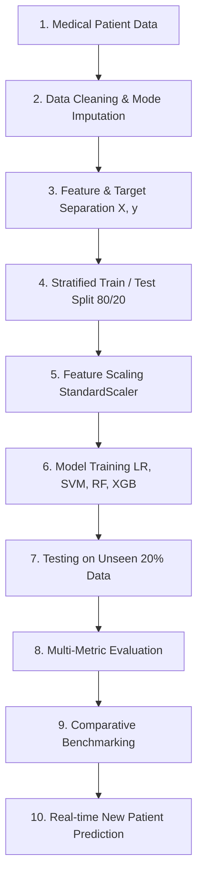

# Task 4: Disease Prediction from Medical Data

Predict the possibility of heart disease based on patient clinical parameters using Machine Learning classification techniques on the **UCI Machine Learning Repository Heart Disease (Cleveland)** dataset.

---

## 📌 Project Overview
- **Objective:** Classify whether coronary heart disease is **Present** or **Absent** from patient diagnostic data.
- **Dataset:** UCI Machine Learning Repository — Cleveland Heart Disease Dataset (303 records, 14 attributes).
- **Core Algorithms:**
  1. **Logistic Regression** (L2 Regularized, Linear Decision Boundary)
  2. **Support Vector Machine (SVM)** (Radial Basis Function Kernel)
  3. **Random Forest Classifier** (Ensemble of 100 Decision Trees)
  4. **XGBoost Classifier** (Gradient Boosted Decision Trees)

---

## 🔬 Dataset & Clinical Features

The dataset comprises 13 clinical predictors ($X$) and 1 target diagnostic status ($y$):

| Feature Name | Description | Clinical Values / Units |
| :--- | :--- | :--- |
| `age` | Patient age | Years (29 – 77) |
| `sex` | Biological sex | `1` = Male, `0` = Female |
| `cp` | Chest pain type | `1`: Typical angina, `2`: Atypical angina, `3`: Non-anginal, `4`: Asymptomatic |
| `trestbps` | Resting blood pressure | mm Hg upon hospital admission |
| `chol` | Serum cholesterol | mg/dl |
| `fbs` | Fasting blood sugar > 120 mg/dl | `1` = True, `0` = False |
| `restecg` | Resting electrocardiographic results | `0`: Normal, `1`: ST-T wave abnormality, `2`: Left ventricular hypertrophy |
| `thalach` | Maximum heart rate achieved | bpm during stress test |
| `exang` | Exercise-induced angina | `1` = Yes, `0` = No |
| `oldpeak` | ST depression induced by exercise | mm relative to resting state |
| `slope` | Slope of peak exercise ST segment | `1`: Upsloping, `2`: Flat, `3`: Downsloping |
| `ca` | Major vessels colored by fluoroscopy | `0` – `3` vessels |
| `thal` | Thallium scintigraphy heart scan | `3`: Normal, `6`: Fixed defect, `7`: Reversible defect |
| `target` | Disease diagnostic outcome | **Absent** (`0`) or **Present** (`1`) |

---

## ⚙️ 10-Step Workflow



1. **Collect Patient Data:** UCI Heart Disease dataset with 303 patient profiles.
2. **Clean Data:** Handled missing values (`ca`: 4 records, `thal`: 2 records) via mode imputation. Checked for zero duplicates.
3. **Feature & Target Separation:** Separated 13 predictors ($X$) and binarized diagnosis target ($y$): `0` = Absent (<50% diameter narrowing), `1` = Present (≥50% diameter narrowing).
4. **Train/Test Split:** 80% training set (242 samples) and 20% test set (61 unseen samples) using stratified sampling.
5. **Feature Scaling:** Applied `StandardScaler` fitted on the training split to avoid data leakage.
6. **Train Classification Models:** Fitted Logistic Regression, SVM, Random Forest, and XGBoost.
7. **Test on Unseen Data:** Evaluated on the held-out test split of 61 unseen patients.
8. **Evaluate:** Measured Accuracy, Precision, Recall (Sensitivity), F1-Score, ROC-AUC, and Confusion Matrices.
9. **Compare Models:** Compared performance trade-offs; Random Forest and XGBoost achieved top test performance.
10. **New Patient Prediction:** Enabled real-time prediction for individual patient cases with risk probability and clinical factor explanation.

---

## 📊 Model Evaluation Results (Unseen Test Data)

| Algorithm | Accuracy | Precision | Recall (Sensitivity) | F1-Score | ROC-AUC | Best For |
| :--- | :---: | :---: | :---: | :---: | :---: | :--- |
| **Random Forest** | **88.52%** | **83.87%** | **92.86%** | **88.14%** | **95.89%** | ★ **Top Overall / F1 / AUC** |
| **XGBoost** | **88.52%** | **83.87%** | **92.86%** | **88.14%** | 94.37% | ★ **Top Accuracy & Speed** |
| **Logistic Regression** | 86.89% | 81.25% | **92.86%** | 86.67% | 95.13% | High Sensitivity / Baseline |
| **SVM (RBF Kernel)** | 85.25% | 80.65% | 89.29% | 84.75% | 94.37% | Non-linear margin separation |

### Confusion Matrix Breakdown (Test Set, N = 61):
- **Random Forest & XGBoost:**
  - True Negatives (TN): **28** (Correctly identified Absent)
  - False Positives (FP): **5**
  - False Negatives (FN): **2** (Only 2 missed positive cases out of 28!)
  - True Positives (TP): **26** (Correctly identified Present)
  - **High Sensitivity / Recall: 92.86%**, minimizing the risk of false negatives in medical screening.

---

## 📈 Visualizations

The pipeline generates 4 analytical plots saved in `static/plots/`:
1. `model_comparison.png`: Side-by-side grouped bar chart of Accuracy, Precision, Recall, and F1.
2. `confusion_matrices.png`: 2x2 grid of confusion matrices across all 4 algorithms.
3. `roc_curves.png`: Multi-classifier ROC curves with area-under-the-curve (AUC) benchmarks.
4. `feature_importance.png`: Feature importance rankings comparing Random Forest vs. XGBoost (identifying `ca`, `thal`, `thalach`, and `cp` as key predictors).

---

## 🚀 How to Run

### 1. Run Complete Training & Evaluation Pipeline
```bash
python3 train_and_evaluate.py
```
This script downloads the UCI data, cleans it, trains all 4 models, evaluates metrics, outputs Step 10 demonstrations, and saves all models and figures.

### 2. Predict on New Patient Data via CLI (Step 10)
```bash
# Test with preset profiles:
python3 predict_patient.py --sample high
python3 predict_patient.py --sample low
python3 predict_patient.py --sample borderline

# Or provide custom clinical parameters:
python3 predict_patient.py --age 62 --sex 1 --cp 4 --trestbps 145 --chol 260 --thalach 125 --exang 1 --oldpeak 2.0 --ca 2
```

### 3. Launch the Interactive Web Dashboard
```bash
python3 app.py
```
Open [http://127.0.0.1:5001](http://127.0.0.1:5001) in your browser to access:
- **Interactive Diagnosis:** Dynamic sliders, 1-click clinical presets, multi-model consensus, and risk factor diagnostics.
- **Model Benchmarks:** Comparison table and visualization plots gallery.
- **Workflow & Pipeline:** Detailed explanation of the 10-step process.
- **Clinical Glossary:** Medical explanations for all 13 attributes.

---

## ⚠️ Educational Disclaimer
This project is developed for **educational, academic, and demonstration purposes** only. Machine learning models should assist researchers and students in understanding predictive analytics and pattern recognition in medical datasets. This system is **not** an authorized clinical diagnostic device and must never substitute for licensed healthcare professional consultation.
